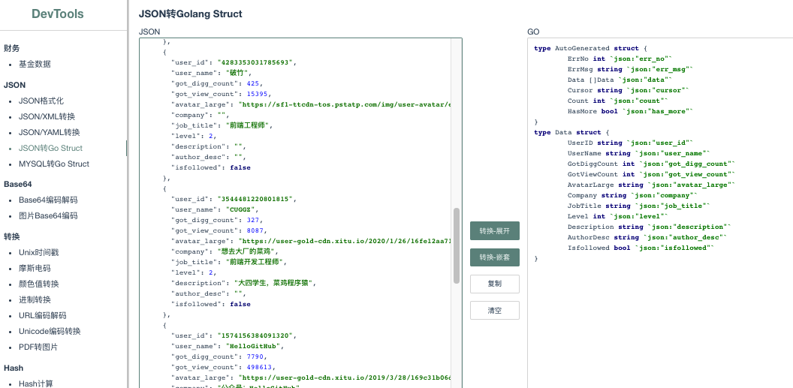
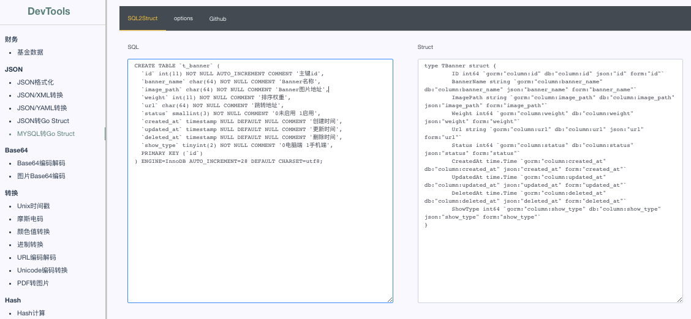

# devTools - golang程序员利器
> 工具的初衷，最大化减少重复性劳动

## 效果预览
> json转golang struct

> mysql转golang struct



## 有哪些功能?
``` go 
      r.GET("/base64", contoller.Base64, middleware.UsageCount)
	r.GET("/image2base64", contoller.Image2Base64, middleware.UsageCount)
	r.GET("/tinyimg", contoller.TinyImage, middleware.UsageCount)
	r.GET("/hash", contoller.Hash, middleware.UsageCount)
	r.GET("/file-hash", contoller.FileHash, middleware.UsageCount)
	r.GET("/ip", contoller.IPInfo, middleware.UsageCount)
	r.GET("/json", contoller.JSONView, middleware.UsageCount)
	r.GET("/number", contoller.Number, middleware.UsageCount)
	r.GET("/placeholder", contoller.Placeholder, middleware.UsageCount)
	r.GET("/qrcode", contoller.QRCode, middleware.UsageCount)
	r.GET("/regex", contoller.Regex, middleware.UsageCount)
	r.GET("/timestamp", contoller.Timestamp, middleware.UsageCount)
	r.GET("/color", contoller.Color, middleware.UsageCount)
	r.GET("/aes", contoller.AES, middleware.UsageCount)
	r.GET("/des", contoller.DES, middleware.UsageCount)
	r.GET("/rsa", contoller.RSA, middleware.UsageCount)
	r.GET("/morse", contoller.Morse, middleware.UsageCount)
	r.GET("/url", contoller.URL, middleware.UsageCount)
	r.GET("/unicode", contoller.Unicode, middleware.UsageCount)
	r.GET("/json2go", contoller.JSON2GO, middleware.UsageCount)
	r.GET("/json2xml", contoller.JSON2XML, middleware.UsageCount)
	r.GET("/json2yaml", contoller.JSON2YAML, middleware.UsageCount)
	r.GET("/pdf2img", contoller.PDF2IMG, middleware.UsageCount)
```

## 打包
> go build main.go
> command-line-arguments
> .\main.go:57:7: undefined: InitRouter


> Windows下编译Mac, Linux平台的64位可执行程序：
* $ SET CGO_ENABLED=0 SET GOOS=darwin3 SET GOARCH=amd64 go build main.go
* $ SET CGO_ENABLED=0 SET GOOS=linux SET GOARCH=amd64 go build main.go
* $ CGO_ENABLED=0  GOOS=linux  GOARCH=amd64 go build ./src/main.go
